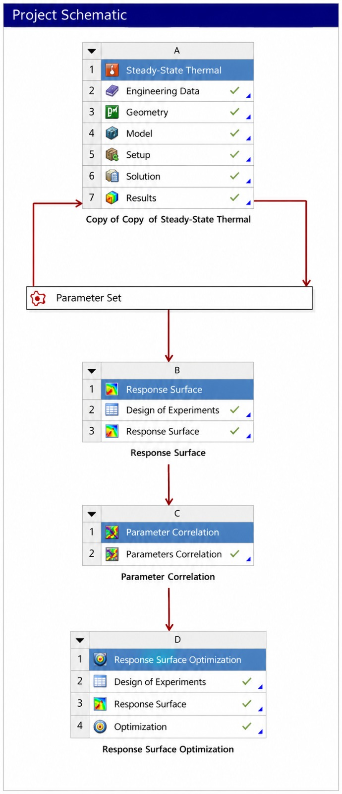

# Adaptive Thermal Management System using ANSYS & MATLAB

<p align="center">
  
</p>

<p align="center">
<b>Complete Design → Simulation → Optimization → MATLAB Controller Development</b>
</p>

---

# Adaptive Thermal Management System (ATMS)

An intelligent thermal management system designed to maintain an aluminium plate at **35°C** under varying external heat loads using **ANSYS Workbench**, **Design of Experiments (DOE)**, **Response Surface Optimization**, and a **MATLAB-based adaptive controller**.

The project demonstrates how simulation-driven optimization can be combined with adaptive control strategies to develop a future-ready thermal management solution suitable for **Electric Vehicle Battery Packs**, **Power Electronics**, and **Electronic Cooling Systems**.

---

# Project Overview

Maintaining a constant operating temperature is essential for improving the performance, reliability, and lifetime of electronic systems. Conventional cooling methods operate at fixed fan speeds and often fail to provide efficient thermal regulation under varying thermal loads.

This project proposes an **Adaptive Thermal Management System (ATMS)** capable of automatically switching between:

-  Heating Mode (Low Heat Load)
-  Cooling Mode (High Heat Load)

to maintain the aluminium plate near the desired operating temperature of **35°C**.

---

# Project Workflow

```
SolidWorks CAD Design
        │
        ▼
ANSYS Steady-State Thermal Analysis
        │
        ▼
Parameter Set
        │
        ▼
Design of Experiments (DOE)
        │
        ▼
Response Surface Generation
        │
        ▼
Parameter Correlation
        │
        ▼
Response Surface Optimization
        │
        ▼
MATLAB Controller Development
        │
        ▼
Adaptive Thermal Management System
```

---

# Key Features

- Adaptive Heating and Cooling Strategy
- Serpentine Heater Design
- Optimized Cooling Fin Geometry
- Steady-State Thermal Analysis
- Design of Experiments (DOE)
- Response Surface Methodology
- Parameter Correlation Analysis
- Response Surface Optimization
- MATLAB Adaptive Controller
- Automatic Fan RPM Prediction
- Temperature-Time Data Analysis
- Future Hardware Implementation Ready

---

# Problem Statement

Electronic devices and EV battery systems experience continuously changing thermal loads during operation.

A conventional cooling system:

- Operates at fixed fan speed
- Consumes unnecessary power
- Cannot maintain constant operating temperature

The proposed Adaptive Thermal Management System automatically determines the required cooling capacity and heating requirement based on the external heat load.

---

# Software Used

- SolidWorks
- ANSYS Workbench
- ANSYS Mechanical
- MATLAB
- Microsoft Excel

---

# ANSYS Optimization Workflow

The optimization was performed using the following ANSYS workflow:

1. Steady-State Thermal Analysis
2. Parameter Set Creation
3. Design of Experiments (DOE)
4. Response Surface Generation
5. Parameter Correlation Analysis
6. Response Surface Optimization
7. Mechanical Verification

Using approximately **30 DOE design points**, a response surface was generated to establish the relationship between:

- Heat Load
- Convection Coefficient
- Plate Temperature

The optimized convection coefficient was then validated using ANSYS Mechanical.

---

# MATLAB Controller Development

The MATLAB program performs the following tasks:

- Imports optimized ANSYS data
- Uses PCHIP interpolation
- Predicts required convection coefficient
- Calculates adaptive fan speed
- Implements adaptive heating strategy
- Analyses Temperature-Time datasets
- Generates engineering plots

Generated outputs include:

- Heat Load vs Convection Coefficient
- Heat Load vs Fan RPM
- Adaptive Heating & Cooling Strategy
- Temperature vs Time Analysis
- Reference vs Adaptive System Comparison

---

# Adaptive Control Strategy

## Heating Mode

External Heat Load:

**0 – 15 W**

Controller Action:

- Heater ON
- Fan OFF
- Natural Convection

---

## Cooling Mode

External Heat Load:

**15 – 120 W**

Controller Action:

- Heater OFF
- Variable Fan Speed
- Adaptive Convection Coefficient

The required convection coefficient is obtained directly from ANSYS Response Surface Optimization.

---

# Engineering Concepts Used

- Heat Conduction
- Natural Convection
- Forced Convection
- Newton's Law of Cooling
- Fourier's Law
- Thermal Resistance
- Finite Element Analysis
- Design Optimization
- Response Surface Methodology
- Adaptive Thermal Control
- MATLAB Programming

---
## Repository Structure

```text
Adaptive-Thermal-Management-System/
│
├── ANSYS/
├── MATLAB/
├── SolidWorks/
├── Images/
├── Report/
├── README.md
└── LICENSE
```

---

# Results

The proposed Adaptive Thermal Management System successfully:

- Maintained the aluminium plate near **35°C**
- Reduced optimization time using DOE
- Generated a Response Surface model
- Predicted the required convection coefficient
- Developed an adaptive MATLAB controller
- Predicted practical BLDC fan speed
- Analysed transient temperature response
- Demonstrated future hardware feasibility

---

# Future Hardware Implementation

The developed MATLAB algorithm can be deployed on embedded hardware using:

- ESP32
- Arduino Mega
- STM32

Hardware Components:

- Temperature Sensor
- PWM BLDC Fan
- Serpentine Heater
- Heater Driver
- PWM Fan Driver

This enables real-time adaptive thermal management.

---

# Future Scope

- CFD Airflow Analysis
- Experimental Validation
- Real-Time Embedded Controller
- IoT Monitoring
- Wireless Temperature Monitoring
- Machine Learning Thermal Prediction
- Digital Twin Integration

---

# Applications

- Electric Vehicle Battery Packs
- Battery Energy Storage Systems
- Power Electronics Cooling
- LED Cooling
- Embedded Systems
- Aerospace Electronics
- Industrial Thermal Management

---

# Contributors

**Abhay Agrahari**

**Abhik Dixit**

---

# License

This project is released under the **MIT License**.

Feel free to use, modify, and contribute for educational and research purposes.

---

# Acknowledgements

The authors sincerely thank their faculty members and mentors for their valuable guidance throughout this project.

Special acknowledgement is extended to:

- ANSYS Workbench
- ANSYS Mechanical
- MATLAB
- SolidWorks

for providing the engineering tools required for design, simulation, optimization, and controller development.

---

<p align="center">

⭐ **If you found this project useful, please consider giving it a Star!**

</p>
